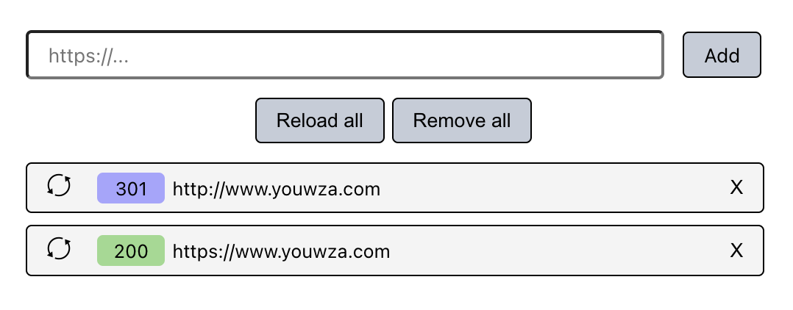

# URL tester code challenge

This project was a code challenge for Ablemind that I created in late 2022.

The challenge was to create a website that follows a Figma design with specific features.

This project is now migrated to use Vite instead of Create React App.

## Required and implemented features

- When clicking on the Add button, a new element will be added to the URL list with the URL from the input field.
- When adding a URL to the list, a POST request will be made to the urlstatus endpoint for the URL tester API. Validating the strings when clicking Add button is beyond the scope for this assignment
- Clicking the reload icon in the list element will made another POST request to the urlstatus endpoint and update the status label accordingly.
- The status label on the list element will contain the status code received from the urlstatus response. The backgound will be colored according to the corresponding status and the Figma design.
- Clicking the close icon will remove the element from the URL list.
- When clicking the Reload all button, update the status for all the elements
  in the list.
- When clicking the Remove all button, clear the list from all entries.
- You can use httpbin status codes as example URLs for testing:
  https://httpbin.org/status/402 will return status code 402

## Screenshot

## Available Scripts

In the project directory, you can run:

### `yarn start`

Runs the app in the development mode.\
Open [http://localhost:3000](http://localhost:3000) to view it in the browser.

The page will reload if you make edits.\
You will also see any lint errors in the console.

### `yarn build`

Builds the app for production to the `build` folder.\
It correctly bundles React in production mode and optimizes the build for the best performance.

The build is minified and the filenames include the hashes.\
Your app is ready to be deployed!
